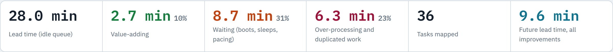
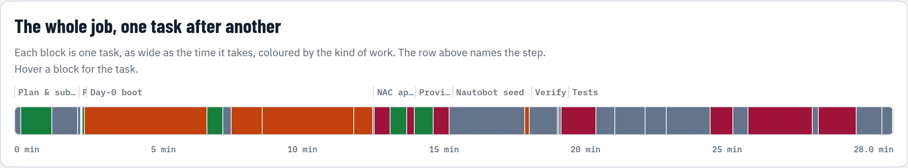
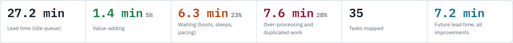
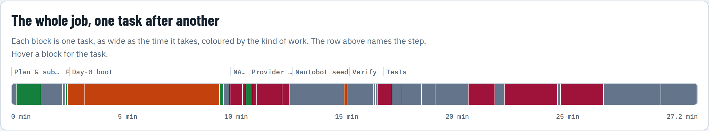

# Detailed Value Stream Map: Provision → Add a customer

The same flow as the [value stream map](README.md), taken one level down: each step broken into the tasks it actually
performs. Each task has its time, the kind of work it is, and **where the number comes from**:
- **measured:** from the job's own log, where every line carries its time;
- **derived:** a measured total split using the code;
- **estimate.**

The VyOS view is cust7's job (Sep 28) and the Catalyst 8000v view is cust5's (Sep 27). These are single actual jobs,
not medians, so the lead times differ from the summary map.

- **Interactive version:** [`detailed.html`](detailed.html), with a C8000v / VyOS toggle and a tooltip on every task.
  Download it and open it in a browser.
- **Images and tables:** `capture.py` redraws them from that page.

## Catalyst 8000v customer

## VyOS customer

## What the task level shows that the step level hides

- **Only 5–10% of the lead time is value-adding.** The step-level map counts the whole day-0 boot as value-adding.
  Task by task, most of it is waiting:
  - A **C8000v** boots twice: once to take its day-0, and again after the licence-level reload. A fixed 60-second
    sleep sits between the two boots, and RESTCONF is then polled every 10 s.
  - A **VyOS** router boots in about 32 s, according to its kernel log. Its day-0 push then takes 330 s, because the
    console tool reads in 2-second windows before it looks for the prompt. That is at least 2 s for each of the 165
    configuration lines.
- **The same check runs three times.** Every host pings every other host in Verify, again in the Routing suite, and
  again from the Network map in the Portal suite. That costs 2.9 min for a C8000v customer and 3.9 min for a VyOS one.
- **Nautobot is walked twice.** The seed compares every object of the lab (133–149 s), and the Nautobot suite's "in
  sync with lab.conf" test repeats the whole walk minutes later (126–129 s).
- **Most of what's pushed hasn't changed.**
  - The Provider link step re-pushes every VyOS router: mpls2 and every VyOS customer, including the new one it
    configured minutes earlier. For cust7 that is about 87 s of the step's 101 s.
  - The NAC step refreshes and saves every C8000v. For a VyOS customer it still runs for 37 s and applies 0 changes.
- **The tests capture configurations of their own** (34–66 s), on top of the job's before and after snapshots.

## Improvements, ranked by the time they save

### Catalyst 8000v customer

<!-- imp:c8000v -->
| # | Improvement | Saves | Basis |
|---|---|---:|---|
| 1 | Test the new customer, not the whole lab | − 8.0 min | measured suites; scoped run of ~2½ min estimated |
| 3 | Boot from a golden image (licence level preset) | − 6.0 min | derived phases; the shorter first boot is an estimate |
| 5 | Seed only the new customer, alongside the boot | − 2.5 min | measured walk; scoped seed estimated |
| 6 | Run Terraform only when there is something to apply, and only on the new router | − 55 s | measured; -target and parallelism estimated |
| 7 | Move the provider push alongside the boot | − 37 s | measured |
| 4 | Push only what changes: the provider, not every VyOS router | − 29 s | measured |
<!-- /imp:c8000v -->

### VyOS customer

<!-- imp:vyos -->
| # | Improvement | Saves | Basis |
|---|---|---:|---|
| 1 | Test the new customer, not the whole lab | − 10.1 min | measured suites; scoped run of ~2½ min estimated |
| 2 | Stop pacing the VyOS console at 2 s a line | − 5.3 min | code + measured total; a fix returns at the prompt |
| 5 | Seed only the new customer, alongside the boot | − 2.2 min | measured walk; scoped seed estimated |
| 4 | Push only what changes: the provider, not every VyOS router | − 1.4 min | measured |
| 6 | Run Terraform only when there is something to apply, and only on the new router | − 37 s | measured; -target and parallelism estimated |
| 7 | Move the provider push alongside the boot | − 14 s | measured |
<!-- /imp:vyos -->

Improvement 2 is a small code change. `tools/vyos_console.py` would return as soon as the prompt appears, not after its
2-second read window, which saves about 5 minutes on every VyOS customer. Improvement 4 is a change to what the
Provider link step pushes. Both are measured, not estimated.

## Every task

### Catalyst 8000v customer (cust5, Sep 27)

<!-- tasks:c8000v -->
#### 1 Plan & submit Operator in the portal

now 2.0 min · 7% of the lead time · future 2.0 min

| Task | Kind | Now | Future | Source |
|---|---|---:|---:|---|
| Open Add a customer — the next name, addresses, ports and tunnel index arrive pre-filled | necessary | 10 s | 10 s | estimate |
| Choose what the customer bought — router type, preferred hub, second provider, applications, company | value-adding | 1.0 min | 1.0 min | estimate |
| Review the plan and capacity, submit — each change re-validates against the running lab in about a second | necessary | 50 s | 50 s | estimate |

#### 2 Prepare Job

now 7.8 s · 0% of the lead time · future 7.8 s

| Task | Kind | Now | Future | Source |
|---|---|---:|---:|---|
| Snapshot every router — each router's running configuration read over SSH, in parallel | necessary | 4 s | 4 s | measured |
| Validate against the running lab — addresses, ports, index, names still free | necessary | 0.4 s | 0.4 s | measured |
| Register in lab.conf and render — the intent written once; configurations generated | value-adding | 0.4 s | 0.4 s | measured |
| Create disks, seed ISO, start the VMs — overlay disk on the base image; the LAN host gets cloud-init | value-adding | 3 s | 3 s | measured |

#### 3 Day-0 boot Job · serial console

now 9.3 min · 33% of the lead time · future 3.3 min

| Task | Kind | Now | Future | Source |
|---|---|---:|---:|---|
| First boot to the console prompt — IOS XE boots from the base image (3–5 min on first boot) | waiting | 4.0 min | 2.5 min | derived |
| Push day-0 over the console — 43 lines + SSH key generation; returns as soon as each prompt appears | value-adding | 30 s | 30 s | derived |
| Licence level check, write memory, reload — the crypto feature set needs network-advantage, active only after a reload | necessary | 15 s | removed | derived |
| Fixed sleep after the reload — sleep 60 in lab.sh, whatever the router is doing | waiting | 1.0 min | removed | derived |
| Second boot to the prompt — the licence level takes effect | waiting | 3.0 min | removed | derived |
| Poll RESTCONF every 10 s — until Network-as-Code can reach the router | waiting | 36 s | 20 s | derived |

#### 4 NAC apply Job · Terraform, RESTCONF

now 1.3 min · 4% of the lead time · future 21 s

| Task | Kind | Now | Future | Source |
|---|---|---:|---:|---|
| terraform init, render check | necessary | 1.5 s | 1.5 s | measured |
| Plan: refresh every router’s state — reads all 7 C8000vs over RESTCONF, though only one is new | waste | 29 s | 5 s | measured |
| Apply 39 resources, one at a time — -parallelism=1: interfaces, tunnel, crypto, BGP on the new router | value-adding | 32 s | 12 s | measured |
| write memory on every C8000v — 7 routers, ~1.9 s each; only the new one changed | waste | 13 s | 2 s | measured |

#### 5 Provider link Job · VyOS push over SSH

now 1.1 min · 4% of the lead time · future 0 s

| Task | Kind | Now | Future | Source |
|---|---|---:|---:|---|
| Push the provider (mpls) — address the new access link; reconcile 1 line | value-adding | 37 s | in parallel | measured |
| Re-push every VyOS customer — cust4 re-pushed (122 lines) and its hook re-run; nothing changed | waste | 29 s | removed | measured |

#### 6 Nautobot seed Job · Nautobot REST API

now 2.5 min · 9% of the lead time · future 0 s

| Task | Kind | Now | Future | Source |
|---|---|---:|---:|---|
| Seed: walk every object of the lab — 56 changes for one customer; the whole lab is compared through the REST API | necessary | 2.5 min | in parallel | measured |

#### 7 Verify Job

now 1.1 min · 4% of the lead time · future 1.1 min

| Task | Kind | Now | Future | Source |
|---|---|---:|---:|---|
| Wait for NHRP, IPsec and BGP to settle | waiting | 6.5 s | 6.5 s | measured |
| Every host pings every other host — 20 pairs | necessary | 54 s | 54 s | measured |
| Render from Nautobot, compare with lab.conf — byte for byte, every file | necessary | 1.5 s | 1.5 s | measured |
| Snapshot every router again — for the job’s configuration diff | necessary | 4 s | 4 s | measured |

#### 8 Tests Job · Robot Framework

now 10.6 min · 38% of the lead time · future 2.7 min

| Task | Kind | Now | Future | Source |
|---|---|---:|---:|---|
| Capture configurations before and after — the test run’s own evidence, on top of the job’s snapshots | waste | 1.1 min | 10 s | measured |
| 01 Management — 7 tests | necessary | 36 s | removed | measured |
| 02 Underlay — 5 tests | necessary | 59 s | removed | measured |
| 03 DMVPN — 6 tests | necessary | 40 s | removed | measured |
| 04 Routing, less the ping-all — 7 tests | necessary | 1.4 min | removed | measured |
| 04 Routing: every host pings every other — the same matrix Verify ran minutes earlier | waste | 43 s | removed | measured |
| 05 NAC compliance — 3 tests | necessary | 28 s | removed | measured |
| 06 Nautobot: model in sync with lab.conf — repeats the seed’s full walk | waste | 2.1 min | removed | measured |
| 06 Nautobot, the rest — 5 tests | necessary | 11 s | removed | measured |
| 07 Portal: ping every host from the map — the matrix a third time | waste | 1.2 min | removed | measured |
| 07 Portal, the rest — 10 tests | necessary | 49 s | removed | measured |
| 08 VyOS customers — 6 tests | necessary | 20 s | removed | measured |
| Customer-scoped checks (future) — the new site’s registrations, routes, reachability, applications; full suite nightly | necessary | — | 2.5 min | estimate |
<!-- /tasks:c8000v -->

### VyOS customer (cust7, Sep 28)

<!-- tasks:vyos -->
#### 1 Plan & submit Operator in the portal

now 2.0 min · 7% of the lead time · future 2.0 min

| Task | Kind | Now | Future | Source |
|---|---|---:|---:|---|
| Open Add a customer — the next name, addresses, ports and tunnel index arrive pre-filled | necessary | 10 s | 10 s | estimate |
| Choose what the customer bought — router type, preferred hub, second provider, applications, company | value-adding | 1.0 min | 1.0 min | estimate |
| Review the plan and capacity, submit — each change re-validates against the running lab in about a second | necessary | 50 s | 50 s | estimate |

#### 2 Prepare Job

now 7.8 s · 0% of the lead time · future 7.8 s

| Task | Kind | Now | Future | Source |
|---|---|---:|---:|---|
| Snapshot every router — each router's running configuration read over SSH, in parallel | necessary | 4 s | 4 s | measured |
| Validate against the running lab — addresses, ports, index, names still free | necessary | 0.4 s | 0.4 s | measured |
| Register in lab.conf and render — the intent written once; configurations generated | value-adding | 0.4 s | 0.4 s | measured |
| Create disks, seed ISO, start the VMs — overlay disk on the base image; the LAN host gets cloud-init | value-adding | 3 s | 3 s | measured |

#### 3 Day-0 boot Job · serial console

now 6.5 min · 24% of the lead time · future 1.2 min

| Task | Kind | Now | Future | Source |
|---|---|---:|---:|---|
| Boot to the login prompt — the kernel log shows the configuration loaded at 32 s | waiting | 40 s | 40 s | derived |
| Push 165 set-lines, 2 s read window each — vyos_console.py reads for 2 s before it looks for the prompt | waiting | 5.5 min | 10 s | derived |
| Commit and save | value-adding | 8 s | 8 s | derived |
| Wait for SSH, install the IKE hook — keeps its IKE proposal IOS-compatible | necessary | 12 s | 12 s | derived |

#### 4 NAC apply Job · Terraform, RESTCONF

now 37 s · 2% of the lead time · future 0 s

| Task | Kind | Now | Future | Source |
|---|---|---:|---:|---|
| terraform init, render check — for a customer with no C8000v resources | waste | 1.4 s | removed | measured |
| Plan and apply: 0 changes — refreshes all 5 C8000vs to find nothing to do | waste | 30 s | removed | measured |
| write memory on every C8000v — 5 routers; none changed | waste | 6.3 s | removed | measured |

#### 5 Provider link Job · VyOS push over SSH

now 1.7 min · 6% of the lead time · future 0 s

| Task | Kind | Now | Future | Source |
|---|---|---:|---:|---|
| Push the provider (mpls) — address the new access link; reconcile 1 line | value-adding | 14 s | in parallel | measured |
| Re-push the second provider (mpls2) — cust7 is not dual-homed: nothing changed | waste | 10 s | removed | measured |
| Re-push cust4, cust5, cust6 — 433 lines and three hook runs; nothing changed | waste | 1.0 min | removed | measured |
| Re-push cust7 itself — day-0 was applied minutes earlier | waste | 16 s | removed | measured |

#### 6 Nautobot seed Job · Nautobot REST API

now 2.2 min · 8% of the lead time · future 0 s

| Task | Kind | Now | Future | Source |
|---|---|---:|---:|---|
| Seed: walk every object of the lab — 57 changes for one customer; the whole lab is compared through the REST API | necessary | 2.2 min | in parallel | measured |

#### 7 Verify Job

now 1.3 min · 5% of the lead time · future 1.3 min

| Task | Kind | Now | Future | Source |
|---|---|---:|---:|---|
| Wait for NHRP, IPsec and BGP to settle | waiting | 6 s | 6 s | measured |
| Every host pings every other host — 30 pairs | necessary | 1.1 min | 1.1 min | measured |
| Render from Nautobot, compare with lab.conf — byte for byte, 12 files | necessary | 2.3 s | 2.3 s | measured |
| Snapshot every router again — for the job’s configuration diff | necessary | 4 s | 4 s | measured |

#### 8 Tests Job · Robot Framework

now 12.8 min · 47% of the lead time · future 2.7 min

| Task | Kind | Now | Future | Source |
|---|---|---:|---:|---|
| Capture configurations before and after — the test run’s own evidence, on top of the job’s snapshots | waste | 34 s | 10 s | measured |
| 01 Management — 7 tests | necessary | 24 s | removed | measured |
| 02 Underlay — 6 tests | necessary | 46 s | removed | measured |
| 03 DMVPN — 7 tests | necessary | 32 s | removed | measured |
| 04 Routing, less the ping-all — 10 tests | necessary | 1.3 min | removed | measured |
| 04 Routing: every host pings every other — the same matrix Verify ran minutes earlier | waste | 1.1 min | removed | measured |
| 05 NAC compliance — 3 tests | necessary | 22 s | removed | measured |
| 06 Nautobot: model in sync with lab.conf — repeats the seed’s full walk | waste | 2.1 min | removed | measured |
| 06 Nautobot, the rest — 5 tests | necessary | 5 s | removed | measured |
| 07 Portal: ping every host from the map — the matrix a third time | waste | 1.8 min | removed | measured |
| 07 Portal, the rest — 27 tests (the map PDFs take 29 s) | necessary | 2.3 min | removed | measured |
| 08 VyOS customers — 6 tests | necessary | 1.4 min | removed | measured |
| Customer-scoped checks (future) — the new site’s registrations, routes, reachability, applications; full suite nightly | necessary | — | 2.5 min | estimate |
<!-- /tasks:vyos -->

## Method

- **Measured** times come from the job records the portal keeps (`webapp/runs/`, git-ignored). A task is the span
  between the log lines that start and end it. Robot Framework times each test.
- **Derived** times split a measured total using the code:
  - `tools/vyos_console.py` reads in 2-second windows, and cust7's day-0 file has 165 lines.
  - `lab.sh bootstrap_c8k` boots, pushes day-0, reloads after a fixed `sleep 60`, boots again, and polls RESTCONF
    every 10 s. Only the C8000v bootstrap's 561 s total is measured; the console logs that would time its phases
    are not readable by the portal.
- **Estimates** are the operator's planning time and the future times that depend on work not yet done: a scoped
  Nautobot seed, customer-scoped tests, and a golden image. A task moved into parallel with the boot counts as zero on
  the critical path.
