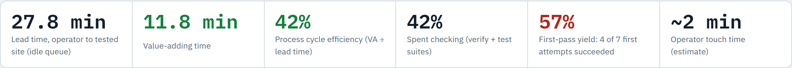
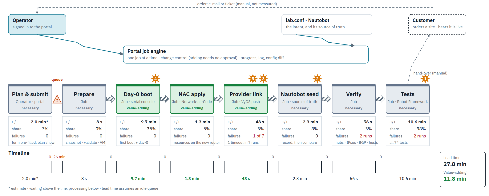
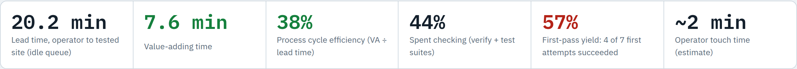
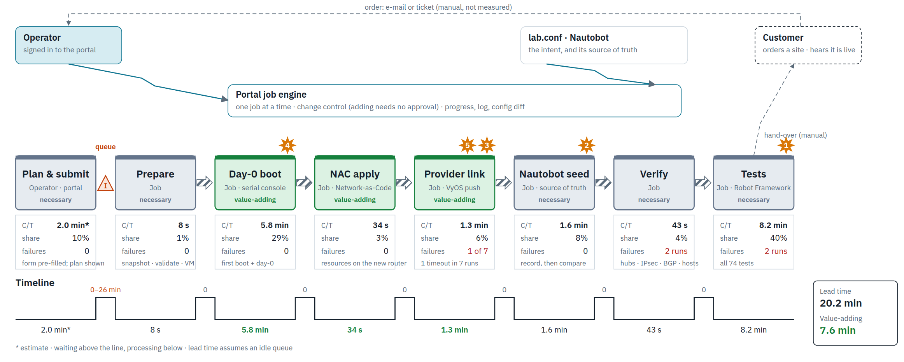

# Value stream: Provision → Add a customer

A current-state value stream map of the portal's **Add a customer** flow. It covers everything from an operator
opening the form to a new site that is registered with all three hubs, recorded in Nautobot and tested.

Every job step time is **measured** from the portal's job records: the 10 Add-a-customer jobs that ran between
Sep 26 and Sep 28, 2026, all of them finished. The operator's planning time, about 2 minutes, is an **estimate**.

- **Interactive version:** [`add-customer.html`](add-customer.html). It switches between a Catalyst 8000v and a VyOS
  customer and lists every job behind the numbers. Download it and open it in a browser; GitHub shows its source only.
- **Images:** `capture.py` redraws them from that page.

## Catalyst 8000v customer

## VyOS customer

## The steps

| Step | What happens | C8000v | VyOS | Kind |
|---|---|---:|---:|---|
| Plan & submit | The operator reviews the pre-filled form and the plan (including capacity), then submits | ~2 min* | ~2 min* | necessary |
| *(queue)* | Jobs run one at a time | 0–26 min | 0–26 min | waiting |
| Prepare | Snapshot every router, validate, register in lab.conf, create the VMs | 8 s | 8 s | necessary |
| Day-0 boot | First boot, day-0 over the serial console (a C8000v also reloads for its licence level) | 9.7 min | 5.8 min | value-adding |
| NAC apply | Network-as-Code: `terraform apply` for the new router's resources | 1.3 min | 34 s | value-adding |
| Provider link | Address the access link on the provider; the customer arrives on its listen range | 48 s | 1.3 min | value-adding |
| Nautobot seed | Record the site in the source of truth, then compare renders | 2.3 min | 1.6 min | necessary |
| Verify | Registered with every hub, IPsec and BGP up, hosts reach each other; snapshot | 56 s | 43 s | necessary |
| Tests | The full Robot Framework suite (74 tests) | 10.6 min | 8.2 min | necessary |
| **Lead time** | with an idle queue | **27.8 min** | **20.2 min** | |
| **Value-adding** | | **11.8 min (42%)** | **7.6 min (38%)** | |

\* estimate. The times are medians of the steps that completed. The C8000v figures come from 2 first attempts and the
VyOS figures from 6. The test times include every full run, passed or failed, because a run takes the same time either
way. The value-adding time counts the whole day-0 boot, although most of it is the router booting: the job log times
the step as a whole, not its phases.

## What the map shows

- **Checking is the biggest block of time.** Verify and the full test suite take 42% of a C8000v customer's lead time
  and 44% of a VyOS customer's. Most of that is testing the whole lab again, not the new site.
- **The day-0 boot is the largest value-adding step, but it is mostly waiting.** It covers the router's first boot and,
  on a C8000v, the reload after setting the licence level.
- **Three steps wait for the boot although they don't need it.** Nautobot and the provider side of the link could run
  alongside it.
- **The first-pass yield is 57%.** 3 of 7 first attempts failed: once when a provider push timed out, and twice when
  verify or the tests ran before routing had settled. A resumed job re-runs only from the step that failed, but each
  failure costs time and an operator's attention.
- **The queue is hidden waiting.** Jobs run one at a time, so a new customer can wait up to about 26 minutes behind
  another job.
- **Two hand-offs happen outside the portal:** the customer's order arrives by e-mail or ticket, and the customer is
  told the site is live. Neither is measured.

## Improvements

| # | Improvement | Saves (C8000v) | Saves (VyOS) |
|---|---|---:|---:|
| 1 | **Test the new customer, not the whole lab.** Check the new site at the end of the job (its registrations, routes, host reachability and applications), and run the full suite on a nightly schedule. | ~8.1 min* | ~5.7 min* |
| 2 | **Seed Nautobot while the router boots.** It does not need the router. | 2.3 min | 1.6 min |
| 3 | **Set up the provider link in parallel too.** It needs only the address plan. | 48 s | 1.3 min |
| 4 | **Use a golden image per router type.** No licence reload, and day-0 shrinks to the site's own lines. | ~4.4 min* | ~2.6 min* |
| 5 | **Raise the first-pass yield.** Retry the provider push with back-off, and start verify and the tests only once routing has settled. | fewer resumes and less rework | same |
| 6 | **Close the loop with the customer.** Take the order through the customer portal, and notify the customer (and create its account) when the job succeeds. | 2 fewer manual hand-offs | same |

\* estimate: a customer-scoped test run of about 2½ minutes, and a golden image saving about 45% of the boot.

## Future state

| | C8000v now | C8000v future | VyOS now | VyOS future |
|---|---:|---:|---:|---:|
| Lead time (idle queue) | 27.8 min | ~12 min | 20.2 min | ~9 min |
| First-pass yield | 57% | ≥ 90% (target) | 57% | ≥ 90% (target) |
| Manual hand-offs | 2 | 0 | 2 | 0 |

## The jobs behind the numbers

| Started | Customer | Router | Outcome | Failed at | Took |
|---|---|---|---|---|---:|
| Sep 26 19:02 | cust4 | Catalyst 8000v | success | — | 14.8 min (no tests) |
| Sep 27 00:43 | cust4 | VyOS | failed | verify | 13.6 min |
| Sep 27 01:04 | cust4 | VyOS | success (resumed) | — | 0.6 min |
| Sep 27 01:59 | cust4 | VyOS | success | — | 16.7 min |
| Sep 27 07:42 | cust5 | Catalyst 8000v | success | — | 25.9 min |
| Sep 27 08:53 | cust5 | VyOS | failed | test | 16.5 min |
| Sep 27 09:46 | cust6 | VyOS | failed | provider | 11.3 min |
| Sep 27 10:02 | cust6 | VyOS | failed (resumed) | verify | 3.8 min |
| Sep 27 10:07 | cust6 | VyOS | failed (resumed) | test | 9.9 min |
| Sep 28 11:35 | cust7 | VyOS | success | — | 25.2 min |

The records are in `webapp/runs/` on the lab host (git-ignored). Each job's steps carry their start and end times.
